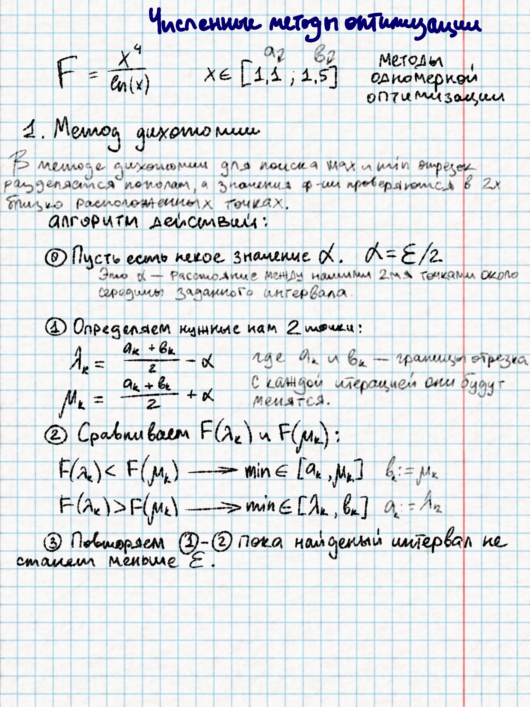
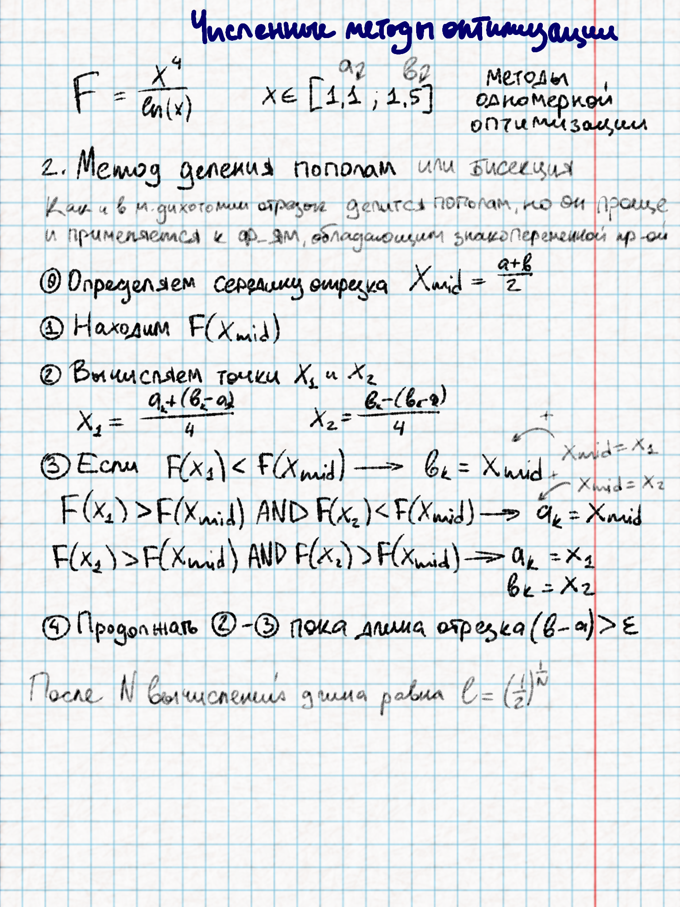
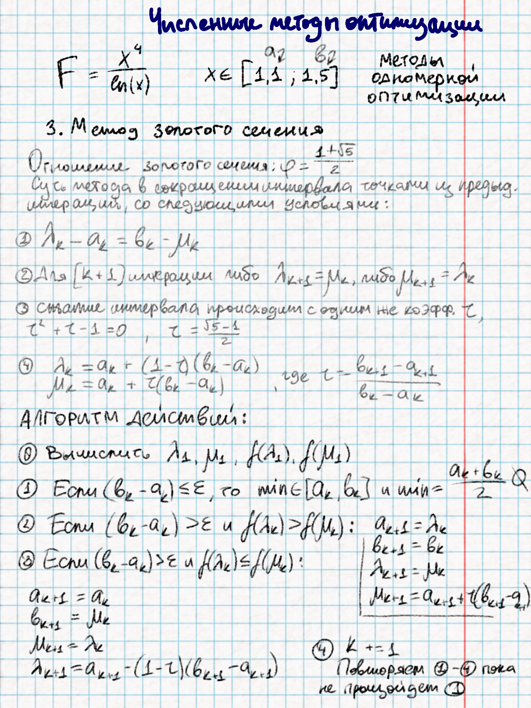
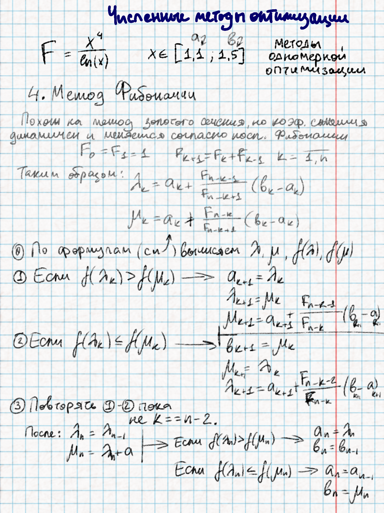

# Реализация четырех методов одномерной оптимизации на примере $F = x^4/ln(x)$

## Метод дихотомии
Теория и алгоритм действий:  

Реализация метода:
```python
def dichotomy(func: callable, a: float, b: float, epsilon: float) -> (Decimal, int):
    """
    Нахождение минимума и количества итераций для его нахождения с помощью метода дихотомии

    :param func: функция
    :param a: нижняя граница
    :param b: высшая граница
    :param epsilon: погрешность
    :return: минимум функции и количество итераций
    """
    a, b, epsilon = Decimal(a), Decimal(b), Decimal(epsilon)
    needed_iterations = math.ceil(math.log((b - a) / epsilon) / math.log(2))
    iterations_count = 0

    alfa = epsilon / 2
    while (b - a) / 2 > epsilon:
        prev_a, prev_b = a, b
        midpoint = (a + b) / 2
        x1 = midpoint - alfa
        x2 = midpoint + alfa

        if func(x1) < func(x2):
            b = x2
        else:
            a = x1
        if (prev_a == a) and (prev_b == b):
            raise ValueError("Что-то пошло не так!")
        iterations_count += 1

    return (a + b) / 2, iterations_count
```

## Метод деления пополам
Теория и алгоритм действий:  
  
Реализация метода:
```python
def bisection(func: callable, a: float, b: float, epsilon: float) -> (Decimal, int):
    """
    Нахождение минимума и количества итераций для его нахождения с помощью метода бисекции

    :param func: функция
    :param a: нижняя граница
    :param b: высшая граница
    :param epsilon: погрешность
    :return: минимум функции и количество итераций
    """
    a, b, epsilon = Decimal(a), Decimal(b), Decimal(epsilon)
    needed_iterations = math.ceil(math.log(2) / math.log(epsilon))

    l = b - a
    iteration_count = 0
    while l > epsilon:
        x_mid = (a + b) / 2
        func_x_mid = func(x_mid)
        x1 = (a + l) / 4
        x2 = (b - l) / 4
        if func(x1) < func_x_mid:
            b = x_mid
        elif func(x2) < func_x_mid:
            a = x_mid
        else:
            a = x1
            b = x2
        l = b - a
        iteration_count += 1
    return (a + b) / 2, iteration_count
```
## Метод золотого сечения
Теория и алгоритм действий:  
  
Реализация метода:
```python
def golden_section(func: callable, a: float, b: float, epsilon: float) -> (Decimal, int):
    """
    Нахождение минимума и количества итераций для его нахождения с помощью метода золотого сечения

    :param func: функция
    :param a: нижняя граница
    :param b: высшая граница
    :param epsilon: погрешность
    :return: минимум функции и количество итераций
    """
    def _delta(_a: Decimal, _b: Decimal, _golden_koef: Decimal) -> Decimal:
        return _a + (1 - _golden_koef) * (_b - _a)

    def _mi(_a: Decimal, _b: Decimal, _golden_koef: Decimal) -> Decimal:
        return _a + _golden_koef * (_b - _a)

    a, b, epsilon = Decimal(a), Decimal(b), Decimal(epsilon)
    golden_koef = Decimal(2 - (1 + math.sqrt(5)) / 2) # обратное золотое сечение
    # needed_iterations = math.log((a - b) / epsilon) / math.log((math.sqrt(5) -1) / 2)

    x1 = _delta(a, b, golden_koef)
    x2 = _mi(a, b, golden_koef)
    f1, f2 = func(x1), func(x2)

    iteration_count = 0
    while (b - a) > epsilon:
        if f1 > f2:
            a = x1
            x1 = x2
            x2 = _mi(a, b, golden_koef)
            f1 = f2
            f2 = func(x2)
        else:
            b = x2
            x2 = x1
            x1 = _delta(a, b, golden_koef)
            f2 = f1
            f1 = func(x1)
        iteration_count += 1
    return (a + b) / 2, iteration_count
```

## Метод Фибоначчи
Теория и алгоритм действий:  
  
Реализация метода:
```python
def golden_section(func: callable, a: float, b: float, epsilon: float) -> (Decimal, int):
    """
    Нахождение минимума и количества итераций для его нахождения с помощью метода золотого сечения

    :param func: функция
    :param a: нижняя граница
    :param b: высшая граница
    :param epsilon: погрешность
    :return: минимум функции и количество итераций
    """
    def _delta(_a: Decimal, _b: Decimal, _golden_koef: Decimal) -> Decimal:
        return _a + (1 - _golden_koef) * (_b - _a)

    def _mi(_a: Decimal, _b: Decimal, _golden_koef: Decimal) -> Decimal:
        return _a + _golden_koef * (_b - _a)

    a, b, epsilon = Decimal(a), Decimal(b), Decimal(epsilon)
    golden_koef = Decimal(2 - (1 + math.sqrt(5)) / 2) # обратное золотое сечение
    # needed_iterations = math.log((a - b) / epsilon) / math.log((math.sqrt(5) -1) / 2)

    x1 = _delta(a, b, golden_koef)
    x2 = _mi(a, b, golden_koef)
    f1, f2 = func(x1), func(x2)

    iteration_count = 0
    while (b - a) > epsilon:
        if f1 > f2:
            a = x1
            x1 = x2
            x2 = _mi(a, b, golden_koef)
            f1 = f2
            f2 = func(x2)
        else:
            b = x2
            x2 = x1
            x1 = _delta(a, b, golden_koef)
            f2 = f1
            f1 = func(x1)
        iteration_count += 1
    return (a + b) / 2, iteration_count
```

## Графики
Вместо того, чтобы показывать четыре отдельных графика зависимости от заданной погрешности, объединим все четыре метода в один график.
```python
def build_graph(
        methods: list[Method],
        func: callable,
        a: float,
        b: float
):
    epsilon_values = logspace(-4, -1, 20)
    plt.figure(figsize=(10, 6))

    for method in methods:
        iterations_list = []
        for epsilon in epsilon_values:
            _, iters = method.method(func, a, b, epsilon)
            iterations_list.append(iters)

        plt.plot(epsilon_values, iterations_list, marker="o", label=method.name)

    plt.xlabel("Погрешность")
    plt.ylabel("Число итераций")
    plt.title("Число итераций в зависимости от погрешности для разных методов")
    plt.xscale("log")
    plt.yscale("log")
    plt.grid(True)
    plt.legend()
    plt.show()
```